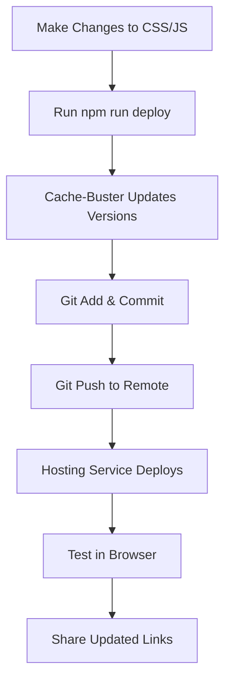

# 🚀 Deployment Guide - Nabin Sinkhwal Portfolio

This guide explains how to deploy your portfolio website with advanced cache-busting to prevent browser caching issues, especially in in-app browsers like Messenger, WhatsApp, etc.

## 📁 Project Structure

```
ME/
├── index.html              # Main website (consolidated)
├── styles.css              # All CSS styles
├── script.js               # All JavaScript functionality
├── cache-buster.js         # Advanced cache-busting script
├── deploy.js               # Automated deployment script
├── package.json            # NPM scripts and metadata
├── favicon.png             # Site icon
└── .cache-backups/         # Automatic backups (created automatically)
```

## 🎯 Key Features

### ✅ **Consolidated Structure**
- **Single HTML file** (`index.html`) - removed duplicates
- **All functionality preserved** - games, projects, about section
- **Clean, maintainable codebase**

### ✅ **Advanced Cache-Busting**
- **Template-based versioning** with `{{CSS_VERSION}}` and `{{JS_VERSION}}` placeholders
- **Automatic timestamp generation** for unique versions
- **Backup system** to prevent data loss
- **File integrity checking** with MD5 hashes

### ✅ **Deployment Automation**
- **One-command deployment** with `npm run deploy`
- **Automatic git operations** (add, commit, push)
- **Error handling and rollback** capabilities

## 🚀 Quick Start

### Method 1: Automated Deployment (Recommended)
```bash
# Deploy everything in one command
npm run deploy
```

### Method 2: Manual Steps
```bash
# 1. Update cache versions
npm run bust-cache

# 2. Commit and push manually
git add .
git commit -m "chore: update cache versions"
git push
```

### Method 3: Direct Script Execution
```bash
# Update cache versions only
node cache-buster.js

# Full deployment
node deploy.js
```

## 📋 Available Scripts

| Script | Command | Description |
|--------|---------|-------------|
| **Deploy** | `npm run deploy` | Complete deployment process |
| **Cache Bust** | `npm run bust-cache` | Update cache versions only |
| **Dev Server** | `npm run dev` | Start local development server |
| **Test** | `npm run test` | Test cache-busting functionality |
| **Clean** | `npm run clean` | Remove backup files |

## 🔧 How Cache-Busting Works

### Before (Problem):
```html
<link rel="stylesheet" href="styles.css">
<script src="script.js"></script>
```
- Browsers cache these files
- Updates don't load in Messenger/WhatsApp browsers
- Users see broken styling or functionality

### After (Solution):
```html
<link rel="stylesheet" href="styles.css?v=1766819359146">
<script src="script.js?v=1766819359146"></script>
```
- Each deployment gets unique version numbers
- Browsers treat versioned files as completely new
- **Forces fresh downloads every time**

## 📱 Testing Your Deployment

### 1. **Local Testing**
```bash
npm run dev
# Visit http://localhost:8000
```

### 2. **Production Testing**
- Wait 2-3 minutes after deployment
- Test in **incognito/private browser** window
- Test on **mobile devices**
- Share link in **Messenger/WhatsApp** to verify

### 3. **Cache Verification**
- Check browser developer tools → Network tab
- Verify CSS/JS files have new version numbers
- Confirm files are downloaded (not cached)

## 🛠️ Customization

### Update Cache-Busting Configuration
Edit `cache-buster.js`:
```javascript
const CONFIG = {
    htmlFiles: ['index.html'],           // HTML files to update
    cssFiles: ['styles.css'],            // CSS files to version
    jsFiles: ['script.js'],              // JS files to version
    versionFormat: 'timestamp',          // 'timestamp', 'hash', 'semantic'
    createBackups: true,                 // Create automatic backups
    backupDir: '.cache-backups'          // Backup directory
};
```

### Version Formats Available:
- **`timestamp`**: `1766819359146` (default, recommended)
- **`hash`**: `a7b3c9d2` (based on file content)
- **`semantic`**: `2024.12.27.0709` (date-based)

## 🚨 Troubleshooting

### **Still seeing old CSS/JS?**
1. **Hard refresh**: Ctrl+F5 (Windows) or Cmd+Shift+R (Mac)
2. **Clear browser cache** completely
3. **Test in incognito mode**
4. **Check version numbers** in HTML source
5. **Wait for CDN propagation** (if using one)

### **Deployment fails?**
1. **Check git status**: `git status`
2. **Verify file permissions**: Ensure scripts are executable
3. **Run manually**: `node cache-buster.js` then `git push`
4. **Check network connection** for git push

### **Files not updating?**
1. **Verify file paths** in `cache-buster.js`
2. **Check backup directory** for previous versions
3. **Ensure template placeholders** exist in HTML

## 📊 Deployment Workflow



## 🎯 Benefits

### ✅ **For Developers**
- **One-command deployment**
- **Automatic backups**
- **Error handling**
- **Clean project structure**

### ✅ **For Users**
- **Always see latest version**
- **No cache issues in any browser**
- **Works in Messenger/WhatsApp/etc.**
- **Consistent experience across devices**

### ✅ **For Maintenance**
- **Consolidated codebase**
- **Automated versioning**
- **Git integration**
- **Rollback capabilities**

## 🔄 Regular Workflow

### Daily Development:
```bash
# 1. Make your changes to HTML/CSS/JS
# 2. Deploy with one command
npm run deploy
# 3. Test and share!
```

### Emergency Rollback:
```bash
# Restore from backup if needed
cp .cache-backups/index.html.TIMESTAMP.backup index.html
git add . && git commit -m "rollback: restore previous version" && git push
```

---

## 🎉 Your Site is Now Cache-Proof!

Your portfolio website now has enterprise-level cache-busting that ensures users always see your latest updates, regardless of their browser or platform. Perfect for sharing on social media, messaging apps, and professional networks!

**Live Site**: [https://nabinsinkhwal.com.np](https://nabinsinkhwal.com.np)

---

*Need help? Check the console output from the deployment scripts - they provide detailed feedback and next steps!*
